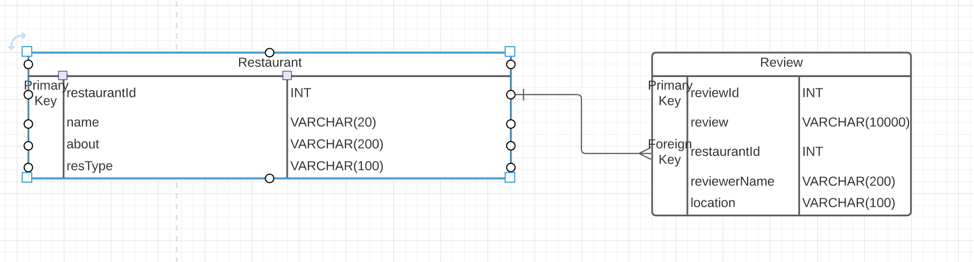
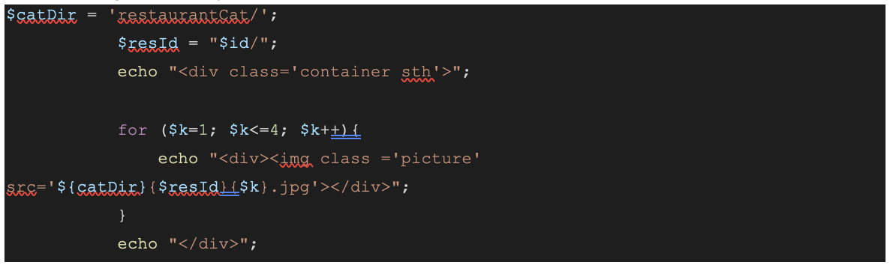

## Yelp Replication Project - CIS4160

**Contributors**: Ahmad Farhan Ishraq, Urooj Nawaz, Chhiring Sherpa

**Presentation Link**: https://youtu.be/Wu\_d2xtTPAE

### Summary Overview:

The following document has been prepared to give a general overview of our project. Our goal was to replicate Yelp.com using the web technologies we learnt throughout the semester.

#### File Structure:

Yelp

- code

  - main.php (This leads to the main landing page)

  - restaurant.php (This leads to corresponding restaurants page)

  - nanvbar.php ( The navigation bar for all pages)

  - postReview.php

  - mysqli\_connect.php

  - review.css

  - style.css
  - restaurantCat(folders holding images of restaurants based on restaurant id)

  - imges(folders holding images of restaurants based on restaurant id)

- yelp\_main.sql (database)

### Database Implementation

For our database, we took into consideration how we want to organize our data throughout our system and we drew a chart before any sql was written:

Our database consists of two tables. One is a restaurant table that holds information about the restaurants in our database and the other one is a review table that holds reviews for each restaurant. The two tables are related through a one to many relationship based on the logic that a restaurant can have multiple reviews and a review by a user can only belong to one restaurant. This database implementation will later help us for querying purposes.

#### User Interaction with our System:

A user will initially start at the main page where details of each restaurant appears on the screen. In order to see a review for a particular restaurant, the user will only need to click on their desired restaurant, and they will be taken to the restaurant&#39;s page. The restaurant&#39;s page contains pictures for the restaurant, details about the business and it&#39;s corresponding reviews. If the user wants to leave a review for the restaurant, the user can click on the &quot;Write a Review&quot; button and they&#39;ll be prompted to leave a review. Upon Submit, the user&#39;s review will be added to the database, and the user will be taken back to the restaurant page, where they can see their review.

#### Highlighted Code/ Features

Below is a list of highlighted code that can be of particular interest:

1. JQuery to make GET requests:

The aforementioned code uses jquery to target the box class, which is the individual div tags holding restaurant details, to capture the restaurantId for the restaurant displayed. Upon a user&#39;s click, the id of the restaurant will be captured as a get request leading to the restaurant.php file. The restaurant.php file is a template php file that generates restaurant details for every restaurant in the database based on the get requests id value.

2. Images and MySQL:

The code, displayed above, queries images for every restaurant locally. As it is considered bad practice to hold images in MySql, we decided to place images for every corresponding restaurant, based on their restaurant id, into our local directory. For example, the src attribute for restaurant with id 1 will read as &quot;restaurantCat/1/1.jpg&quot;.
